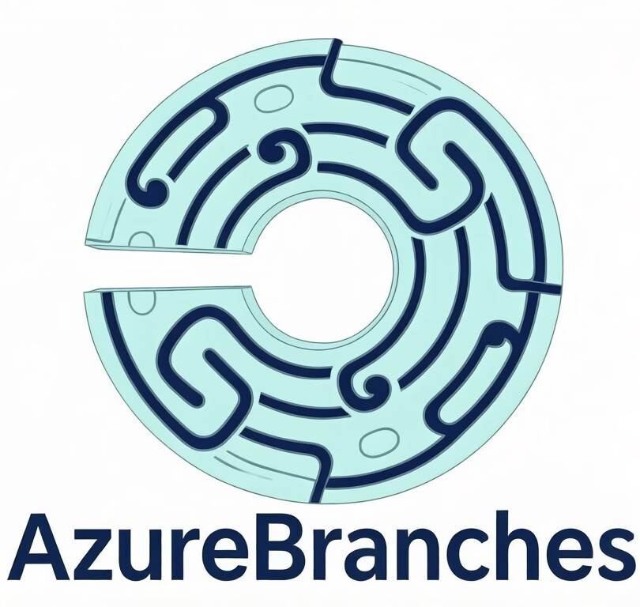

<p align="center">
  
</p>

# AzureBranches

> 在多线程 Regionized Ticking 模型下，追求命令方块语义完整性的 Folia 下游实验项目

## 关于本项目

AzureBranches 是一个独立的实验性 Minecraft 服务端，基于 [Folia](https://github.com/PaperMC/Folia) 的 Regionized Ticking 架构。项目的核心目标是：**在保持 Folia 多线程模型性能优势的前提下，系统性地恢复命令方块的语义完整性**——使得 `/setblock`、`/fill`、`/clone`、`/execute`、连锁方块、循环方块、积分板操作以及实体 NBT 修改等核心机制在跨区域场景中正确工作。

Folia 通过将世界划分为独立的 Region（16×16 区块网格）并在每个 Region 上并行执行 tick，大幅提升了多核 CPU 利用率。但这一架构也带来了命令方块语义的断裂：一条命令方块链可能跨越多个 Region，而每个 Region 的 tick 是独立且异步的。AzureBranches 的 EXP 系统正是为解决这一问题而设计的——它在 Folia 的悲观 Region 所有权模型之上，叠加了一层乐观并发控制（Optimistic Concurrency Control, OCC）协议。

## 版本演进

### v1.0 — 基础设施
- Moonrise IO 子系统与 BalancedThreadPool
- WorkerThreadPool 线程池管理
- EntityLimiter 实体限流引擎（受 Kaiiju 启发）
- AzureBranchesConfig TOML 配置系统
- 构建流水线：paperweight 补丁体系 + paperclip 打包

### v1.0-EXP — 命令方块执行模式
- **SAFE** 模式：默认禁用命令方块（与原版 Folia 行为一致）
- **ACCESS** 模式：在 Region 线程上执行命令，containFailure 防止崩溃传播
- **EXP** 模式：可挂起/可恢复的异步命令方块链
- ExpChainSupport：ThreadLocal 回执袋、DeferredContext、跨 Region 批量调度
- SetBlockCommand awaitable 化（首个跨 Region 异步试点命令）

### EXP v2 — Walking/Waiting 分离
- ChainHead：Walking 锁与 traversalId 单调递增版本号
- Continuation：链快照 + superseded 标记（MVCC 继承）
- Walker 前瞻批量调度：同 Region 命令批量入队，单次 queueOrExecuteTickTask 派发
- 回执机制：per-Region CompletableFuture → whenComplete → aggregateAndResume
- 配置：`command_blocks.exp.batch_max_size`、`success_count_mode`（SUM/ALL/ANY）

### EXP2_PB — Phase-Based 一致性快照
- PhaseSnapshot：per-Walking-Phase 方块状态缓存
- 识别并解决 EXP2 的读取语义缺陷（前写后读断裂、跨 Phase 不确定性）
- 设计哲学：接受 Phase 内部单线程一致性，承认 Phase 之间的状态漂移，将 Phase 边界作为天然的一致性窗口

### EXP3 — OCC 乐观验证系统
- PhaseValidator：三阶段 OCC（执行→验证→提交/回滚）
- readSet 记录（跨 Region 读集）+ oldBlockStates（写入前旧状态）
- Savepoint 机制：Phase 内部分回滚
- Irreversible Operations 标记（ARIES Nested Top Action 语义）
- 确定性重放：traversalRandomSeed + deterministicHash
- IsolationLevel 枚举：SNAPSHOT / READ_COMMITTED
- 构建时 codegen：规避 paperweight 3-way merge 行号漂移

### EXP4 — 完整实体 OCC 栈（当前版本）

**ScoreLayer — 积分板逆操作补偿**
- 基于整数加法群 (Z, +) 的阿贝尔性质，使用 Δ 逆操作替代值恢复
- 并发修改天然保留：`compensation = current − (new − old)`
- 所有积分板操作（add/remove/set/operation）统一归约为 Δ 补偿

**EntityLayer — NBT 表分区**
- 48 个实体 NBT 标签映射到 5 个语义类别
- IDENTITY（跳过回滚）· NUMERIC（Δ 补偿）· VALUE（值恢复）· SLOT（槽位稳定键）· RELATIONAL（标记 irreversible）
- 使用 `Slot:0b` 标签值替代列表索引，解决槽位漂移问题

**DeferredAction — 实体生命周期 WAL**
- 借鉴 ARIES Write-Ahead Logging 范式
- KILL / TP / SUMMON 三种操作延迟至 Phase 提交时批量执行
- 24 字节/条，float-packed 坐标，零额外堆分配
- Phase rollback 时全量丢弃

**数据池拦截**
- `Level.getBlockState()` 层注入 PhaseSnapshot 透明缓存
- 覆盖所有方块读写命令，无需逐命令适配

**PhaseValidator 扩展**
- CHECK_SCORE_READ_SET：积分板 OCC 读集验证

详见 [技术文档](https://github.com/XCxyTianQ/AzureBranches/releases/tag/v26.1.2-EXP4) 及 `F:\AzureCore\AzureDoc\` 下的完整技术文档。

## 架构概览

```
┌─────────────────────────────────────────────────────────┐
│                    Folia Regionized Ticking               │
│  Region A (0,0)    Region B (1,0)    Region C (2,0)     │
│  ┌──────────┐      ┌──────────┐      ┌──────────┐       │
│  │ Entity   │      │ Entity   │      │ Entity   │       │
│  │ Redstone │      │ Redstone │      │ Redstone │       │
│  │ Command  │      │ Command  │      │ Command  │       │
│  └──────────┘      └──────────┘      └──────────┘       │
└─────────────────────────────────────────────────────────┘
                         │
         ┌───────────────┼───────────────┐
         ▼               ▼               ▼
┌─────────────────────────────────────────────────────────┐
│              AzureBranches EXP 系统                       │
│                                                          │
│  ChainHead (traversalId + Walking锁 + Continuation集合)   │
│       │                                                  │
│       ▼                                                  │
│  PhaseSnapshot (四层缓存)                                │
│  ├─ blockCache / oldBlockStates / readSet                │
│  ├─ scoreCache / oldScoreValues / scoreReadSet           │
│  ├─ nbtCache / nbtOldValues / nbtReadSet                │
│  └─ deferredActions (KILL/TP/SUMMON WAL)                │
│       │                                                  │
│       ▼                                                  │
│  PhaseValidator (OCC 三阶段验证)                         │
│  ├─ CHECK_READ_SET_SIZE                                  │
│  ├─ CHECK_READ_SET (方块读集)                            │
│  ├─ CHECK_SCORE_READ_SET (积分板读集)                    │
│  └─ CHECK_WRITE_SET (traversalId supersede)              │
│       │                                                  │
│       ├── COMMIT  ──→  应用写入 + 执行DeferredAction     │
│       └── RETRY   ──→  ScoreLayer/EntityLayer补偿 + 重试  │
└─────────────────────────────────────────────────────────┘
```

## 命令方块执行模式

| 模式 | 行为 | 适用场景 |
|------|------|---------|
| **SAFE** | 禁用所有命令方块（Folia 默认行为） | 纯生存服务器 |
| **ACCESS** | Region 线程执行 + containFailure 兜底 | 单 Region 命令 |
| **EXP** | 异步链式执行 + OCC 验证 + Phase 回滚 | 跨 Region 复杂链 |

## 构建

**环境要求：** JDK 21+

```bash
# 源码变更后需删除缓存以触发重编译
rm -f folia-server/build/cache/folia-paperclip.jar

# 步骤 1：应用补丁并构建 Folia 本体
./gradlew :azurebranches-server:buildFolia --no-configuration-cache

# 步骤 2：合并 AzureBranches 自定义类
./gradlew :azurebranches-server:mergeJar --no-configuration-cache
```

产物：`folia-server/build/libs/azurebranches-server-*.jar`

详细的构建说明和常见问题请参见 [技术文档](https://github.com/XCxyTianQ/AzureBranches/releases)。

## 技术文档

完整的技术文档（.docx 格式）位于各 Release 附件中。每份文档涵盖对应版本的设计原理、架构详解、算法证明、命令覆盖分析和构建指南：

| 版本 | 文档 | Release |
|------|------|---------|
| EXP2 | Phase-Based 一致性快照系统 | [v26.1.2-0003-EXP2](https://github.com/XCxyTianQ/AzureBranches/releases/tag/26.1.2-0003-EXP2) |
| EXP2_PB | Walking/Waiting 分离与 Continuation MVCC | [v26.1.2-EXP2_PB](https://github.com/XCxyTianQ/AzureBranches/releases/tag/v26.1.2-EXP2_PB) |
| EXP3 | OCC 乐观验证系统（含数据库理论溯源） | [v26.1.2-EXP3](https://github.com/XCxyTianQ/AzureBranches/releases/tag/v26.1.2-EXP3) |
| **EXP4** | **完整实体 OCC 栈（ScoreLayer / EntityLayer / DeferredAction）** | [**v26.1.2-EXP4**](https://github.com/XCxyTianQ/AzureBranches/releases/tag/v26.1.2-EXP4) |

## 理论基础

AzureBranches 的设计借鉴了计算机科学中多个成熟的并发控制与恢复理论：

- **OCC 乐观并发控制** (Kung & Robinson, 1981)：读集记录 → 验证 → 提交/回滚
- **ARIES 恢复算法** (Mohan et al., 1992)：Write-Ahead Logging、补偿日志、Nested Top Action
- **Saga 补偿模式** (Garcia-Molina & Salem, 1987)：逆操作语义
- **整数加法群 (Z, +)**：积分板逆操作补偿的代数基础
- **Snapshot Isolation** (Berenson et al., 1995)：Phase 级别的快照隔离

## 灵感来源与致谢

本项目的部分功能灵感来源于 [LuminolMC](https://github.com/LuminolMC/Luminol)（配置系统和实体优化思路），我们的实现对其进行了简化与重新设计，以适应 AzureBranches 自身的架构方向。

在此，谨向 **Luminol 开发团队 (EarthMe 等)** 致以最深的敬意——他们的开创性工作为 Folia 下游生态树立了标杆，我们从中受益良多。

## 注意事项

- **不推荐生产使用**：AzureBranches 目前处于实验阶段，服务端在区块读取与 IO 优化方面尚显不足。EXP 系统已经过多轮设计与理论验证，但尚未经过大规模实际游戏测试。
- **性能追求**：如果你对服务端性能有更高要求，建议转向更成熟的 [Arbor](https://github.com/LittleOvO233/Arbor)，其在区块优化、实体管理等维度均经过长期打磨。
- **宣发**：当前阶段不建议对 AzureBranches 进行大规模宣发或推荐至生产环境。本项目更适合对 Folia 命令方块机制、并发控制理论和 Minecraft 服务端架构感兴趣的研究者与开发者进行学习与测试。

## 许可

MIT License. 详见 [LICENSE](LICENSE) 文件。
