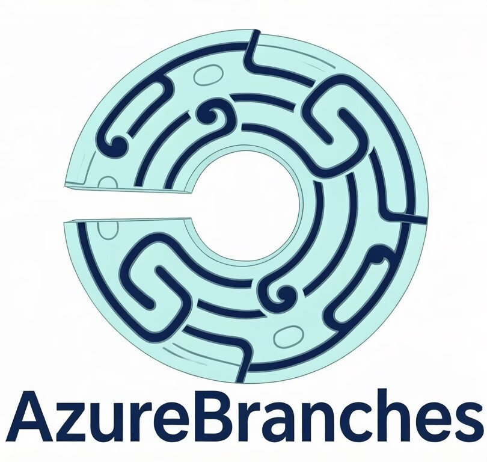

<p align="center">
  
</p>

# AzureBranches

> 在多线程 Regionized Ticking 模型下，追求命令方块语义完整性的 Folia 下游实验项目

## 关于本项目

AzureBranches 是一个独立的实验性 Minecraft 服务端，基于 [Folia](https://github.com/PaperMC/Folia) 的 Regionized Ticking 架构。项目的核心目标是：**在保持 Folia 多线程模型性能优势的前提下，系统性地恢复命令方块的语义完整性**——使得 `/setblock`、`/fill`、`/clone`、`/execute`、连锁方块、循环方块、积分板操作以及实体 NBT 修改等核心机制在跨区域场景中正确工作。

Folia 通过将世界划分为独立的 Region（16×16 区块网格）并在每个 Region 上并行执行 tick，大幅提升了多核 CPU 利用率。但这一架构也带来了命令方块语义的断裂：一条命令方块链可能跨越多个 Region，而每个 Region 的 tick 是独立且异步的。AzureBranches 的 EXP 系统正是为解决这一问题而设计的——它在 Folia 的悲观 Region 所有权模型之上，叠加了一层乐观并发控制（Optimistic Concurrency Control, OCC）协议。

## 版本演进

### v1.0 — 基础设施
- Moonrise IO 子系统与 BalancedThreadPool
- WorkerThreadPool 线程池管理
- EntityLimiter 实体限流引擎（受 Kaiiju 启发）
- AzureBranchesConfig TOML 配置系统
- 构建流水线：paperweight 补丁体系 + paperclip 打包

### v1.0-EXP — 命令方块执行模式
- **SAFE** 模式：默认禁用命令方块（与原版 Folia 行为一致）
- **ACCESS** 模式：在 Region 线程上执行命令，containFailure 防止崩溃传播
- **EXP** 模式：可挂起/可恢复的异步命令方块链
- ExpChainSupport：ThreadLocal 回执袋、DeferredContext、跨 Region 批量调度
- SetBlockCommand awaitable 化（首个跨 Region 异步试点命令）

### EXP v2 — Walking/Waiting 分离
- ChainHead：Walking 锁与 traversalId 单调递增版本号
- Continuation：链快照 + superseded 标记（MVCC 继承）
- Walker 前瞻批量调度：同 Region 命令批量入队，单次 queueOrExecuteTickTask 派发
- 回执机制：per-Region CompletableFuture → whenComplete → aggregateAndResume
- 配置：`command_blocks.exp.batch_max_size`、`success_count_mode`（SUM/ALL/ANY）

### EXP2_PB — Phase-Based 一致性快照
- PhaseSnapshot：per-Walking-Phase 方块状态缓存
- 识别并解决 EXP2 的读取语义缺陷（前写后读断裂、跨 Phase 不确定性）
- 设计哲学：接受 Phase 内部单线程一致性，承认 Phase 之间的状态漂移，将 Phase 边界作为天然的一致性窗口

### EXP3 — OCC 乐观验证系统
- PhaseValidator：三阶段 OCC（执行→验证→提交/回滚）
- readSet 记录（跨 Region 读集）+ oldBlockStates（写入前旧状态）
- Savepoint 机制：Phase 内部分回滚
- Irreversible Operations 标记（ARIES Nested Top Action 语义）
- 确定性重放：traversalRandomSeed + deterministicHash
- IsolationLevel 枚举：SNAPSHOT / READ_COMMITTED
- 构建时 codegen：规避 paperweight 3-way merge 行号漂移

### EXP4 — 完整实体 OCC 栈

**ScoreLayer — 积分板逆操作补偿**
- 基于整数加法群 (Z, +) 的阿贝尔性质，使用 Δ 逆操作替代值恢复
- 并发修改天然保留：`compensation = current − (new − old)`
- 所有积分板操作（add/remove/set/operation）统一归约为 Δ 补偿

**EntityLayer — NBT 表分区**
- 48 个实体 NBT 标签映射到 5 个语义类别
- IDENTITY（跳过回滚）· NUMERIC（Δ 补偿）· VALUE（值恢复）· SLOT（槽位稳定键）· RELATIONAL（标记 irreversible）
- 使用 `Slot:0b` 标签值替代列表索引，解决槽位漂移问题

**DeferredAction — 实体生命周期 WAL**
- 借鉴 ARIES Write-Ahead Logging 范式
- KILL / TP / SUMMON 三种操作延迟至 Phase 提交时批量执行
- 24 字节/条，float-packed 坐标，零额外堆分配
- Phase rollback 时全量丢弃

**数据池拦截**
- `Level.getBlockState()` 层注入 PhaseSnapshot 透明缓存
- 覆盖所有方块读写命令，无需逐命令适配

**PhaseValidator 扩展**
- CHECK_SCORE_READ_SET：积分板 OCC 读集验证

详见 [技术文档](https://github.com/XCxyTianQ/AzureBranches/releases/tag/v26.1.2-EXP4) 及 `F:\AzureCore\AzureDoc\` 下的完整技术文档。

### EXP4Plus — 跨区命令恢复

**RegionCommandExecutor — 跨区执行桥**
- 同步阻塞 + 2s 超时的跨 region RPC 原语：`onBlock`（queueOrExecuteTickTask）/ `onEntity`（EntityScheduler.scheduleOrExecute）
- `CommandSyntaxException` 跨线程透传；超时兜底保证两 region 互等死锁最多 2 秒
- 自定义 `BlockTask` / `EntityTask` 函数接口，值对象跨线程传递

**Folia 被禁命令恢复（/data /tag /trigger）**
- vanilla 命令树原样保留，只改造数据访问层（accessor / 执行体），无需重写命令
- `BlockDataAccessor` / `EntityDataAccessor`：`getData`/`setData` 在目标 region 线程执行，源线程不再跨区解引用
- `TagCommand` / `TriggerCommand`：逐实体跳转所属 region（含 displayName 目标区获取）

**构建：azurepatches 覆盖层**
- `azurepatches-src`（覆盖现有文件，fail-fast 校验目标存在）+ `azurepatches-new`（新增类）
- 规避手写 patch 的 hunk 维护成本；applyAllPatches + transformSource 之后整文件覆盖

**Folia 上游修复**
- 控制台 null-level 兜底：`executeCommandInContext` / `broadcastToAdmins`（修复前所有控制台命令含 /stop 均 NPE）
- OCC 回滚恢复失败不再静默：逐条记录日志

详见 [技术文档](https://github.com/XCxyTianQ/AzureBranches/releases/tag/v26.1.2-EXP4Plus) 及 `F:\AzureCore\AzureDoc\` 下的完整技术文档。

### EXP5 — 非阻塞命令执行 + OCC 回滚接通

**RegionCommandExecutor 非阻塞化**
- 新增异步原语 `onBlockAsync` / `onEntityAsync`（返回 CompletableFuture，region 线程不阻塞）
- `runOnSource` 把 sendSuccess/sendFailure 路由回源 region；控制台 null-level 直接内联
- 同步 `onBlock`/`onEntity` 保留为 legacy，在 tick 线程上阻塞时打一次性警告
- `workerPool()` 供 DataAccessor 默认异步方法回退

**/data 全异步**
- `DataAccessor` 新增 `getDataAsync` / `setDataAsync` 默认方法（worker 池回退）
- `BlockDataAccessor` / `EntityDataAccessor` 直接走 `onBlockAsync` / `onEntityAsync`
- `DataCommands` 全部终端处理器改为 CompletableFuture 链 + 回源反馈

**/tag 全异步**
- 逐实体 `onEntityAsync`，`allOf().whenComplete` 聚合 + `runOnSource` 回源

**OCC 回滚链路彻底接通**
- `PhaseSnapshot` 读集取值捕获：`readSetValues` + `recordRead(pos, state, tick)`
- `Level.getBlockState()` 注入记录读到的状态值
- `CommandBlock.verifyReadSetAndResume` 真实跨区校验读集 → 喂给 `PhaseValidator.validate` → RETRY 可达
- 冲突时 `rollbackAndRetryExpChain` 恢复方块 + `retryExpChainPhase` 重放

详见 [技术文档](https://github.com/XCxyTianQ/AzureBranches/releases/tag/v26.1.2-EXP5)。

### EXP5Plus — /scoreboard 全局 tick 恢复

**RegionCommandExecutor 全局 tick 桥**
- 新增 `onGlobalAsync` / `onGlobal` 原语：服务器全局数据（积分板等）只能在全局 tick 线程上访问，跨线程调用排队到 `RegionizedServer.addTask`，已在全局线程时（控制台命令）内联执行形成同源快路径

**/scoreboard 恢复**
- Folia 在注册层禁用了该命令（`Commands.java` 注释），现重新注册
- `ScoreboardCommand` 覆盖层：全部终端处理器（含 ObjectiveArgument / ScoreHolderArgument 的参数解析）整体派发到全局 tick 线程执行
- 反馈经 `runOnSource` 路由回源 Region；控制台 null-level 直接内联
- 实体型积分板持有者（`@e` 选择器、玩家名）的反馈显示名经 `onEntityAsync` 在实体所属 Region 捕获（同 /tag 模式），错误消息使用不可变的 scoreboard name 避免跨线程解引用
- 建议提供器（suggestTriggers 等）保留只读直查，与 /trigger 同等的 best-effort 语义
- 异步路径返回乐观占位值 1，快路径（控制台）返回精确结果，与 /data 语义一致

**P2 — 命令方块 EXP OCC 闭环**
- `PhaseSnapshot` 增加积分板读集取值层（`scoreReadSetValues` + `recordScoreRead(key, value, tick)`），`resetForRetry` 同步清理
- `ExpChainSupport.setPhaseSnapshot`：跨线程传播快照；`ScoreboardCommand.dispatch` 把链的 PhaseSnapshot 种子到全局 tick 任务上（try/finally 清理），使数据池钩子持续记录到同一 Phase
- 全局 tick future 注册进 EXP 链回执袋（`registerRemote`）：链在积分板变异与捕获落地后才继续下一块命令方块
- **数据池拦截（transformSource 注入 Scoreboard.java）**：
  - 读：`getPlayerScoreInfo` 缓存透传（同 Phase 读己写）+ 读集取值记录（OCC 基线）
  - 写：匿名 `ScoreAccess.set`（set/add/increment/reset 的唯一变异点）捕获 `putScore(new, old)` + `markPendingScore`
  - `resetAllPlayerScores` / `resetSinglePlayerScore` 移除前捕获旧值
- **OCC 验证接通**：`verifyReadSetAndResume` 把积分板读集比对派发到全局 tick（live vs observed），结果喂给 `PhaseValidator.validate` 的 `CHECK_SCORE_READ_SET` → RETRY 可达
- **回滚补偿改道**：`rollbackAndRetryExpChain` 中 `ScoreLayer.compensate` / `EntityLayer.compensate` 先经 `onGlobalAsync` 在全局 tick 执行，再链式恢复方块、回到头 Region 重放 Phase
- 新增积分板拦截计数器（写/读/缓存命中）

详见 [技术文档](https://github.com/XCxyTianQ/AzureBranches/releases/tag/v26.1.2-EXP5Plus)。

### EXP6 — EntityLayer 注入与 /data 实体 NBT 的 OCC 闭环

**捕获点选择：命令层而非数据池**
- DataCommands 覆盖层在 /data 的六条执行流（get / getNumeric / resolveSourcePath / modify / merge / remove）中以 NBT 路径粒度记录读集取值与写前旧值
- `EntityLayer.parsePathString` 把 26.1 的路径文法（向量下标、equipment 槽位、复合子字段）归一到稳定复合键
- 26.1 NBT 键名迁移逐键核对：`FallDistance → fall_distance`、`Leash → leash`、`HandItems/ArmorItems → equipment` map 等
- `PhaseSnapshot` 四个 NBT 映射改为并发容器，容忍实体区域线程上的并发捕获

**校验与补偿闭环**
- `verifyReadSetAndResume` 按实体分组、经 `onEntityAsync` 在实体所属区域重读实况并与观测值比对 → `CHECK_NBT_READ_SET` → RETRY 可达
- 补偿改道：`EntityLayer.compensateFor` 按实体分派（修正 EXP5Plus P2 的全局 tick 线程违规）
- **快路径修复**：Folia 的 `scheduleOrExecute` 在实体所属 tick 线程上仍排队到下一 tick——`RegionCommandExecutor.onEntityAsync` 改为 `TickThread.isTickThreadFor(entity)` 时内联执行，链内同区域 /data 恢复同步语义

详见 [技术文档](https://github.com/XCxyTianQ/AzureBranches/releases/tag/v26.1.2-EXP6)。

### EXP6Plus — Scoreboard 实体维度的读集与幽灵分数防护（当前版本）

**实体维度读集（第四个 OCC 数据域）**
- `ScoreHolderArgument.getNames` 捕获：/scoreboard 选择器解析出的实体集合以（实体 ID → scoreboardName 观测值）进入 `PhaseSnapshot`（`entityReadSet` / `entityReadSetValues`）
- `ScoreboardCommand` 全部终端处理器重构为源线程解析 holder——实体迭代是区域数据，修正全局 tick 线程上的线程契约违规

**校验与幽灵分数防护**
- `verifyReadSetAndResume` 逐实体经 `onEntityAsync` 复核存在性：`isRemoved() || !isAlive() || getEntity == null`——**!isAlive 覆盖死亡动画窗口**（已死未移除的实体仍可被 getEntity 返回）
- 实体消失 → `CHECK_ENTITY_READ_SET` → RETRY → 整 Phase 重放
- 回滚补偿对已死实体 holder **跳过数值写回并主动清除分数条目**（计入补偿失败统计）——工程实测发现 **Folia 已将 `Scoreboard.entityRemoved` 注释禁用**，死实体的分数条目不会像 vanilla 那样自动消失，仅"跳过写回"不足以防护幽灵分数

**跨 Phase 携带**
- `Continuation` 新增实体读集与分数写状态携带字段，`PhaseSnapshot.fromContinuation` 继承——"phase N 解析、phase N+1 死亡"的冲突可被检出
- 携带复制延迟到挂起屏障完成之后（全局 tick 的分数写落在挂起窗口内）

详见 [技术文档](https://github.com/XCxyTianQ/AzureBranches/releases/tag/v26.1.2-EXP6Plus)。

## 架构概览

```
┌─────────────────────────────────────────────────────────┐
│                    Folia Regionized Ticking               │
│  Region A (0,0)    Region B (1,0)    Region C (2,0)     │
│  ┌──────────┐      ┌──────────┐      ┌──────────┐       │
│  │ Entity   │      │ Entity   │      │ Entity   │       │
│  │ Redstone │      │ Redstone │      │ Redstone │       │
│  │ Command  │      │ Command  │      │ Command  │       │
│  └──────────┘      └──────────┘      └──────────┘       │
└─────────────────────────────────────────────────────────┘
                         │
         ┌───────────────┼───────────────┐
         ▼               ▼               ▼
┌─────────────────────────────────────────────────────────┐
│              AzureBranches EXP 系统                       │
│                                                          │
│  ChainHead (traversalId + Walking锁 + Continuation集合)   │
│       │                                                  │
│       ▼                                                  │
│  PhaseSnapshot (五层缓存)                                │
│  ├─ blockCache / oldBlockStates / readSet                │
│  ├─ scoreCache / oldScoreValues / scoreReadSet           │
│  ├─ nbtCache / nbtOldValues / nbtReadSet                │
│  ├─ entityReadSet / entityReadSetValues（实体维度读集）   │
│  └─ deferredActions (KILL/TP/SUMMON WAL)                │
│       │                                                  │
│       ▼                                                  │
│  PhaseValidator (OCC 三阶段验证)                         │
│  ├─ CHECK_READ_SET_SIZE                                  │
│  ├─ CHECK_READ_SET (方块读集)                            │
│  ├─ CHECK_SCORE_READ_SET (积分板读集)                    │
│  ├─ CHECK_NBT_READ_SET (实体 NBT 读集)                   │
│  ├─ CHECK_ENTITY_READ_SET (scoreboard 实体维度读集)      │
│  └─ CHECK_WRITE_SET (traversalId supersede)              │
│       │                                                  │
│       ├── COMMIT  ──→  应用写入 + 执行DeferredAction     │
│       └── RETRY   ──→  ScoreLayer/EntityLayer补偿 + 重试  │
└─────────────────────────────────────────────────────────┘
```

## 命令方块执行模式

| 模式 | 行为 | 适用场景 |
|------|------|---------|
| **SAFE** | 禁用所有命令方块（Folia 默认行为） | 纯生存服务器 |
| **ACCESS** | Region 线程执行 + containFailure 兜底 | 单 Region 命令 |
| **EXP** | 异步链式执行 + OCC 验证 + Phase 回滚 | 跨 Region 复杂链 |

## 构建

**环境要求：** JDK 21+

```bash
# 源码变更后需删除缓存以触发重编译
rm -f folia-server/build/cache/folia-paperclip.jar

# 步骤 1：应用补丁并构建 Folia 本体
./gradlew :azurebranches-server:buildFolia --no-configuration-cache

# 步骤 2：合并 AzureBranches 自定义类
./gradlew :azurebranches-server:mergeJar --no-configuration-cache
```

产物：`folia-server/build/libs/azurebranches-server-*.jar`

详细的构建说明和常见问题请参见 [技术文档](https://github.com/XCxyTianQ/AzureBranches/releases)。

## 技术文档

完整的技术文档（.docx 格式）位于各 Release 附件中。每份文档涵盖对应版本的设计原理、架构详解、算法证明、命令覆盖分析和构建指南：

| 版本 | 文档 | Release |
|------|------|---------|
| EXP2 | Phase-Based 一致性快照系统 | [v26.1.2-0003-EXP2](https://github.com/XCxyTianQ/AzureBranches/releases/tag/26.1.2-0003-EXP2) |
| EXP2_PB | Walking/Waiting 分离与 Continuation MVCC | [v26.1.2-EXP2_PB](https://github.com/XCxyTianQ/AzureBranches/releases/tag/v26.1.2-EXP2_PB) |
| EXP3 | OCC 乐观验证系统（含数据库理论溯源） | [v26.1.2-EXP3](https://github.com/XCxyTianQ/AzureBranches/releases/tag/v26.1.2-EXP3) |
| **EXP4** | **完整实体 OCC 栈（ScoreLayer / EntityLayer / DeferredAction）** | [**v26.1.2-EXP4**](https://github.com/XCxyTianQ/AzureBranches/releases/tag/v26.1.2-EXP4) |
| **EXP4Plus** | **跨区命令恢复（RegionCommandExecutor + /data /tag /trigger）** | [**v26.1.2-EXP4Plus**](https://github.com/XCxyTianQ/AzureBranches/releases/tag/v26.1.2-EXP4Plus) |
| **EXP5** | **非阻塞异步命令执行（/data /tag）+ OCC 回滚接通** | [**v26.1.2-EXP5**](https://github.com/XCxyTianQ/AzureBranches/releases/tag/v26.1.2-EXP5) |
| **EXP5Plus** | **/scoreboard 全局 tick 恢复 + 积分板 OCC 闭环** | [**v26.1.2-EXP5Plus**](https://github.com/XCxyTianQ/AzureBranches/releases/tag/v26.1.2-EXP5Plus) |
| **EXP6** | **EntityLayer 注入与 /data 实体 NBT 的 OCC 闭环** | [**v26.1.2-EXP6**](https://github.com/XCxyTianQ/AzureBranches/releases/tag/v26.1.2-EXP6) |
| **EXP6Plus** | **Scoreboard 实体维度读集与幽灵分数防护** | [**v26.1.2-EXP6Plus**](https://github.com/XCxyTianQ/AzureBranches/releases/tag/v26.1.2-EXP6Plus) |

## 理论基础

AzureBranches 的设计借鉴了计算机科学中多个成熟的并发控制与恢复理论：

- **OCC 乐观并发控制** (Kung & Robinson, 1981)：读集记录 → 验证 → 提交/回滚
- **ARIES 恢复算法** (Mohan et al., 1992)：Write-Ahead Logging、补偿日志、Nested Top Action
- **Saga 补偿模式** (Garcia-Molina & Salem, 1987)：逆操作语义
- **整数加法群 (Z, +)**：积分板逆操作补偿的代数基础
- **Snapshot Isolation** (Berenson et al., 1995)：Phase 级别的快照隔离

## 灵感来源与致谢

本项目的部分功能灵感来源于 [LuminolMC](https://github.com/LuminolMC/Luminol)（配置系统和实体优化思路），我们的实现对其进行了简化与重新设计，以适应 AzureBranches 自身的架构方向。

在此，谨向 **Luminol 开发团队 (EarthMe 等)** 致以最深的敬意——他们的开创性工作为 Folia 下游生态树立了标杆，我们从中受益良多。

## 注意事项

- **不推荐生产使用**：AzureBranches 目前处于实验阶段，服务端在区块读取与 IO 优化方面尚显不足。EXP 系统已经过多轮设计与理论验证，但尚未经过大规模实际游戏测试。
- **性能追求**：如果你对服务端性能有更高要求，建议转向更成熟的 [Arbor](https://github.com/LittleOvO233/Arbor)，其在区块优化、实体管理等维度均经过长期打磨。
- **宣发**：当前阶段不建议对 AzureBranches 进行大规模宣发或推荐至生产环境。本项目更适合对 Folia 命令方块机制、并发控制理论和 Minecraft 服务端架构感兴趣的研究者与开发者进行学习与测试。

## 许可

MIT License. 详见 [LICENSE](LICENSE) 文件。
